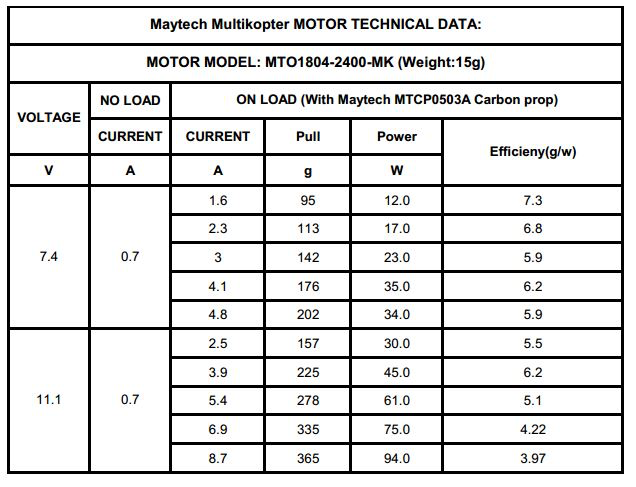
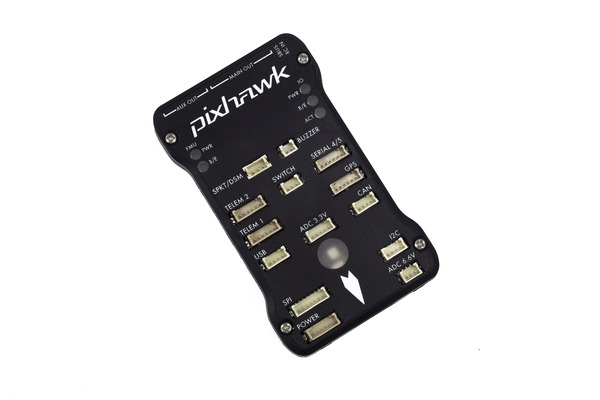

# 必要な部品

## Motor

MAYTECH社 
MTO1804-2400-Q-MK CW

## Controller

Hobbyking 
KK2.1.5 Multi-rotor LCD Flight Control Board With 6050MPU And Atmel 644PA

3DR-Pixhawk 

Pixhawk
[回路図](https://pixhawk.org/_media/modules/px4fmuv1.7.pdf)

# Body
JR-62005 ロアフレー 
JR-62004 アッパーフレーム 
JR-62008 リヤアーム 
JR-62007 フロントアーム 
JR-62006 フレームサポート 
JR-87036 パワーコントロールボード 

## 会社のリンク
[Shanghai Maytech Electronics Co., Ltd]( http://www.maytech.cn/maytech/eng/default.asp) 
[Maytech Twitter](https://twitter.com/maytechrcmodel) 
[Hobbyking](http://www.hobbyking.com/)