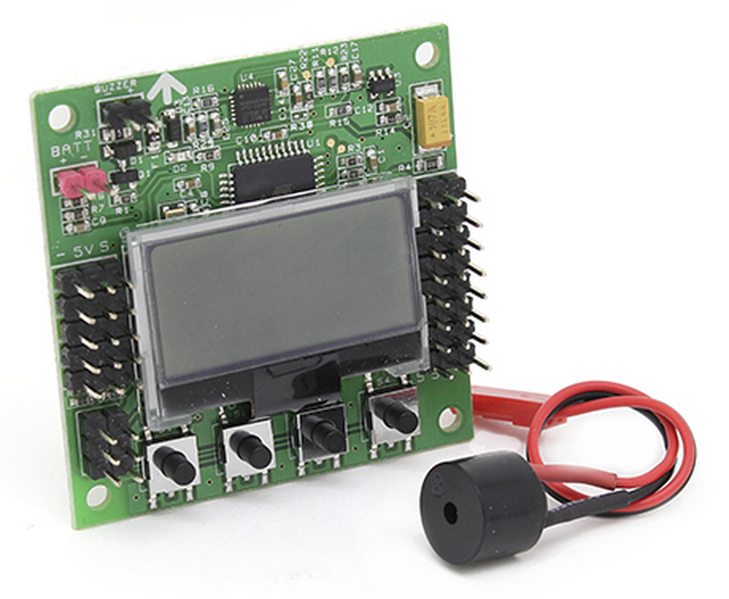

# 必要な部品

## Motor

MAYTECH社 
MTO1804-2400-Q-MK CW

## Controller

Hobbyking 
KK2.1.5 Multi-rotor LCD Flight Control Board With 6050MPU And Atmel 644PA

## 会社のリンク
[Shanghai Maytech Electronics Co., Ltd]( http://www.maytech.cn/maytech/eng/default.asp) 
[Maytech Twitter](https://twitter.com/maytechrcmodel) 
[Hobbyking](http://www.hobbyking.com/)